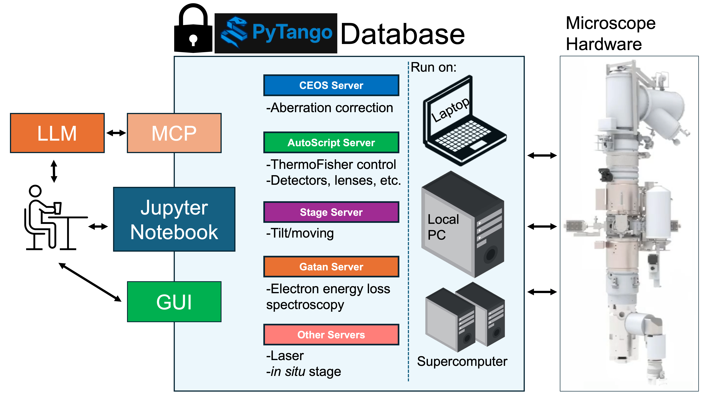

# Asyncroscopy:
- Enabling smart microscopy via asynchronous servers

magick architecture.png -background white -alpha remove -alpha off architecture_fixed.png


Note: `main` branch now contains the PyTango-based architecture. The previous Twisted-based implementation is preserved in the `twisted-legacy` branch for reference.
---

# Q. Are you here to just directly dive in and do some hands on??
see: [Tutorial notebook](notebooks/1_Client_tutorial.ipynb)

---


## Project layout(Updated on 20th Feb 2026)

```
.
├── src/
│   ├── Microscope.py              # Main device — owns AutoScript connection and all acquisition commands
│   ├── detectors/
│   │   ├── HAADF.py               # HAADF detector settings device
│   │   ├── EELS.py                # EELS detector settings device (stub)
│   │   ├── EDS.py                 # EDS detector settings device (stub)
│   │   └── CEOS.py                # CEOS detector settings device (stub)
│   ├── hardware/
│   │   ├── STAGE.py               # Stage position and movement device
│   │   └── BEAM.py                # Beam blanking and current device
│   └── acquisition/
│       └── advanced_acquisition.py  # Multi-detector acquisition helpers (stub)
├── tests/
│   ├── conftest.py                # Shared pytest fixtures (DeviceTestContext proxies)
│   ├── test_microscope.py         # Microscope device tests
│   ├── test_acquisition.py        # Acquisition tests
│   └── detectors/
│       └── test_HAADF.py          # HAADF device tests
├── notebooks/
│   └── Client.ipynb               # Tutorial: connect → configure → acquire → display
├── llm-context/                   # AutoScript and PyTango API corpus for LLM-assisted development
├── AS_commands.txt                # AutoScript API reference snippets
└── pyproject.toml
```

### Contributing and Design principle
See - docs/dev_guide.md

## Requirements and Installation

### Core installation (simulation mode)

```bash
pip install .
```

or with `uv`:

```bash
uv sync
```

This installs `asyncroscopy` and all core dependencies. AutoScript is not required—the
framework will fall back to simulated acquisition automatically.

### Hardware installation (Thermo Fisher AutoScript)

By default, the project uses **stubs** (metadata-only wheels) in the `stubs/` directory to satisfy
dependency resolution. These stubs do **not** contain any proprietary code.

If you have access to the real proprietary AutoScript wheels, place them in a local directory
(e.g., `./hardware_wheels/`) and install them over the stubs:

```bash
uv pip install ./hardware_wheels/*.whl --force-reinstall
```

> [!WARNING]
> Never place your real wheels in the `stubs/` directory, as they would be tracked by Git.
> Always use a separate, ignored directory for real hardware files.

## Running tests

```bash
uv run pytest tests/ -v
```
