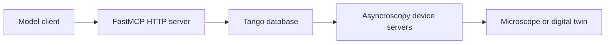

# Asyncroscopy MCP Implementation

The asyncroscopy MCP server lets local or remote model clients call live Tango
device commands through FastMCP.



## Runtime Contract

Start the Tango/device stack:

```bash
uv run startup_scripts/run_servers.py --yaml configs/Spectra300.yaml
```

Start MCP separately:

```bash
uv run startup_scripts/run_mcp.py --yaml configs/mcp.yaml
```

`configs/mcp.yaml` is the explicit MCP config. It contains the Tango endpoint,
the MCP HTTP endpoint, the DATA device address, and the command blocklist.

## What MCP Does At Startup

`MCPServer`:

1. Connects to the Tango database.
2. Lists exported devices.
3. Skips blocked Tango classes.
4. Queries each device's commands and attributes.
5. Skips blocked names.
6. Registers the remaining commands and attribute accessors as FastMCP tools.
7. Registers the native tools `list_devices`, `refresh_devices`,
   `get_data_from_key` and `list_acquisitions`.

There is no package search, source introspection requirement, or separate
AutoScript-specific MCP class.

## Tool Names

Tools are named `<TangoClass>_<name>`. Commands keep their command name;
attributes become `get_<attr>` and, when writable, `set_<attr>` (the setter's
single parameter is named after the attribute). `State`/`Status` attributes are
skipped because the commands already exist.

```text
SCAN_State
SCAN_get_dwell_time
SCAN_set_dwell_time        (dwell_time: float)
STAGE_get_x
AutoScriptMicroscope_acquire_scanned_image
DATA_get_config
```

Attribute tools are what let a GUI or agent change dwell time, image size,
exposure or a stage axis without a Tango client. The blocklist and
`include_only_functions` apply to attribute tool names (`set_output_format`)
exactly as to commands.

Discovery runs at startup; call `refresh_devices` after starting a device server
later. Every proxy uses a 30 s Tango timeout except the long DATA registration
commands, which get their own longer timeouts.

## Data Access

The bridge reads Tiled through `asyncroscopy.data.tiled_client` using the URI
from the DATA device; MCP does not need the microscope filesystem.

- `list_acquisitions(acquisition_type=None, since=None, limit=20, with_metadata=True)`:
  recent keys newest first, each with the instrument-state metadata recorded at
  acquisition.
- `get_data_from_key(key, max_values=64)`: shape/dtype/attrs and a small
  flattened preview of one key.
- `acquire_scanned_image`, `acquire_camera_image` and `acquire_spectrum` results
  additionally carry an inline PNG preview. TIFF acquisitions return a JSON
  list of keys; the first one is previewed.

Full arrays are not routed through MCP; a GUI reads them from the Tiled HTTP
server directly (`DATA_get_config` gives the URI).

## Safety Boundary

MCP exposes hardware-control commands, so the YAML blocklist is part of the
runtime safety boundary. Keep destructive or server-management commands blocked:

```yaml
blocked_classes:
  - DataBase
  - DServer
blocked_functions:
  "*":
    - Init
    - Kill
    - RestartServer
```

Add project-specific exclusions before connecting an autonomous model client.
